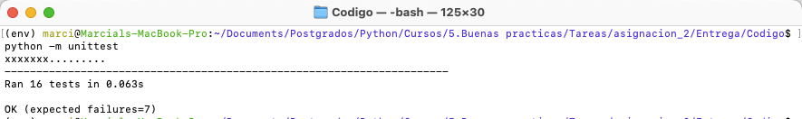

.. Asignacion #2 de BPP documentation master file, created by
   sphinx-quickstart on Wed Apr 27 13:00:56 2022.
   You can adapt this file completely to your liking, but it should at least
   contain the root `toctree` directive.

Bienvenido a la documentacion de la Asignacion #2 de BPP!
=========================================================

Descripción
-----------
Este programa ha sido diseñado para la ejecución de pruebas unitarias para las funciones
definidas durante la Asignación #2 del Máster de Python versión 5

.. toctree::
   :maxdepth: 2
   :caption: Contenido:

   modules

Librerías y módulos
-------------------
- ``unittest`` librería utilizada para para el desarrollo de las pruebas
- ``pandas`` librería requerida para la creación y gestión de DataFrames
- ``assert_fram_equal`` método de ``pandas.testing`` requerido para evaluar si DataFrames son iguales
- ``plotly`` necesario para la creación de las gráficas
- ``os`` para la creación del directorio donde se almacenará la gráfica
- :mod:`errors`: Excepciones especialmente definidas para la aplicación
- :mod:`funciones`: contiene las funciones que vamos a probar ``create_df`` y ``check``

Librerías
~~~~~~~~~~
El programa hace uso de la líbrería ``unittest`` para la definición y ejecución de las pruebas unitarias
El mismo, debe ser instalada a través del administrador de paquetes ``pip``

.. code-block:: bash

   pip install unittest2

De igual forma se debe proceder a la instalación de las librerías ``pandas`` y ``plotly``

.. code-block:: bash

   pip install pandas plotly

Script principal
~~~~~~~~~~~~~~~~~
- :mod:`test_funciones`: Contiene las pruebas unitarias diseñadas para las funciones 
   - :func:`funciones.create_df`
   - :func:`funciones.check`

Módulos
~~~~~~~
- :mod:`errors`: Contiene las excepciones especialmente definidas para la aplicación
- :mod:`funciones`: contiene las funciones que vamos a probar ``create_df`` y ``check``

.. note:: 
    Es necesario disponer de los siguientes ficheros csv para poder realizar las pruebas. 
    Asimismo, deben encontrase en el mismo directorio donde se almacene los archivos ``.py``

    1. *prueba.csv*
    2. *prueba2.csv*
    3. *prueba3.csv*

Resultado esperado
------------------
Para ejecutar las pruebas unitarias se debe ejecutar el siguiente comando desde la terminal

.. code-block:: bash

   python -m unittest

.. note::
   **Recuerda** Debemos encontrarnos en el directorio donde esten los scripts ``.py`` y ficheros ``csv`` necesarios

Una vez ejecutado debemos obtener la siguiente respuesta que nos indica lo siguiente:
 - Se han ejecutado 16 pruebas
 - 7 de las 16 pruebas se han diseñado a fallo
 - El resultado del test: ``Ok``
 

Indices y tablas
------------------

* :ref:`genindex`
* :ref:`modindex`
* :ref:`search`

Autor
-----
- Creado por Marcial Mosqueda