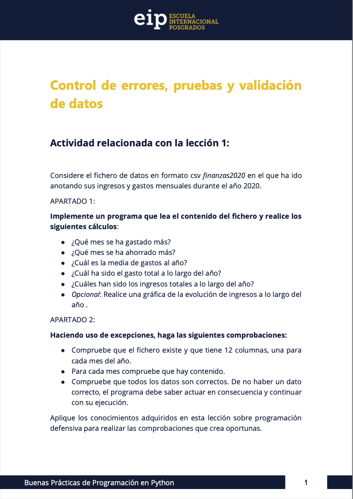

# BPP

*Hola!!!*

Bienvenidos al repositorio de **BPP** donde encontrará las asignaciones del curso de `Buenas Prácticas de Programación en Python`!!!

Desarrollado por: Marcial Mosqueda

## Contenido

El contenido se divide en `4` asignaciones que abarcan diferentes temas:

1. `Asignación 1`: Control de errores, pruebas y validación de datos

    

2. `Asignación 2`: Comprender la importancia del desarrollo guiado por pruebas

    

3. `Asignación 3`: Programación dirigida a la documentación

    

4. `Asignación 4`: Depuración y reglas de optimización de código

    